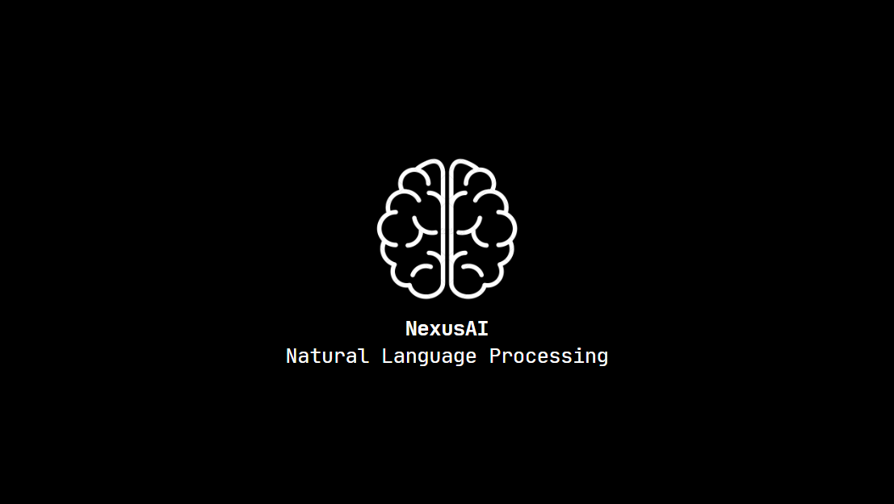

# NexusAI

[](LICENSE)
[](https://www.python.org/)
[](https://www.nltk.org/)



NexusAI is an AI Chatbot with basic conversational skills and [NLP (Natural Language Processing)](https://en.wikipedia.org/wiki/Natural_language_processing) capabilities. It is built using [Python](https://www.python.org/).

## Tech

NexusAI was built using NLTK, which is a Natural Language Processing Python Library.

## Installation

NexusAI requires [Python](https://www.python.org/) v3+ to run.

Then follow the steps below:

```sh
$ git clone https://github.com/FujiwaraChoki/NexusAI.git
$ cd NexusAI
$ pip install -r requirements.txt
$ python src/main.py
```

## License

NexusAI is licensed under the [GNU General Public License V3.0](LICENSE).